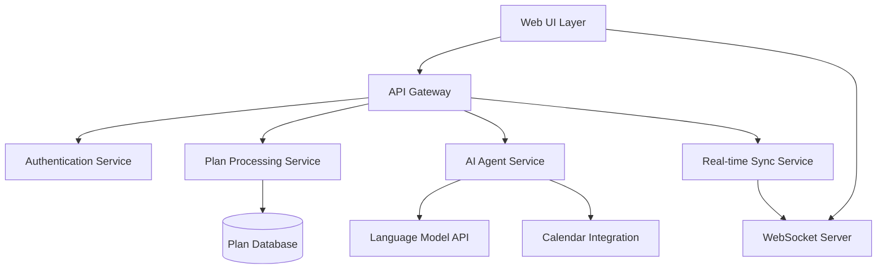

# Design Document

## Overview

The AI Planning Assistant is a modern web application built around a natural language interface with embedded, persistent plan elements. The architecture centers on real-time AI agent processing, user-controlled change approval workflows, and seamless cross-device synchronization. The system processes natural language input to create structured plans while maintaining user authority over all AI-generated modifications.

## Architecture

### High-Level Architecture



### Core Components

1. **Natural Language Processor**: Handles initial parsing and understanding of user input
2. **Plan Engine**: Manages plan creation, storage, and modification
3. **AI Agent Orchestrator**: Coordinates multiple AI agents for different enhancement tasks
4. **Change Management System**: Handles AI-generated suggestions and user approval workflows
5. **Real-time Sync Engine**: Manages cross-device synchronization and conflict resolution
6. **Calendar Integration Service**: Handles external calendar connections and event management

## Components and Interfaces

### Frontend Components

#### PlanCanvas Component
- **Purpose**: Main interface displaying all embedded plans
- **Key Features**:
  - Masonry/grid layout for multiple plans
  - In-place editing for all plan elements
  - Real-time updates from AI agents
  - Drag-and-drop organization
- **State Management**: Uses React Context for plan state with optimistic updates

#### NaturalLanguageInput Component
- **Purpose**: Accepts and processes natural language plan input
- **Key Features**:
  - Voice-to-text support
  - Auto-save as user types
  - Intelligent parsing indicators
  - Multi-modal input (text, voice, paste)

#### ChangeApprovalModal Component
- **Purpose**: Presents AI-generated changes for user review
- **Key Features**:
  - Side-by-side diff view
  - Individual change approval/rejection
  - Inline editing of AI suggestions
  - Batch approval options

#### ContextualChat Component
- **Purpose**: Provides AI assistance with full plan context
- **Key Features**:
  - Sidebar or overlay positioning
  - Plan reference highlighting
  - Suggestion integration with main UI
  - Conversation history

### Backend Services

#### Plan Processing Service
```typescript
interface PlanService {
  createPlan(input: NaturalLanguageInput): Promise<Plan>
  updatePlan(planId: string, changes: PlanChanges): Promise<Plan>
  getPlansByUser(userId: string): Promise<Plan[]>
  triggerAIProcessing(planId: string): Promise<void>
}
```

#### AI Agent Service
```typescript
interface AIAgentService {
  processNaturalLanguage(input: string): Promise<StructuredPlan>
  enhancePlan(plan: Plan): Promise<Enhancement[]>
  generateCalendarEvents(plan: Plan): Promise<CalendarEvent[]>
  suggestOptimizations(plan: Plan, userHistory: UserHistory): Promise<Suggestion[]>
}
```

#### Real-time Sync Service
```typescript
interface SyncService {
  broadcastPlanUpdate(planId: string, changes: PlanChanges): void
  handleConflictResolution(conflicts: SyncConflict[]): Promise<Resolution>
  syncOfflineChanges(userId: string, changes: OfflineChange[]): Promise<SyncResult>
}
```

## Data Models

### Plan Model
```typescript
interface Plan {
  id: string
  userId: string
  title: string
  content: NaturalLanguageContent
  structuredData: StructuredPlanData
  metadata: PlanMetadata
  version: number
  createdAt: Date
  updatedAt: Date
}

interface StructuredPlanData {
  type: PlanType // 'routine' | 'meal' | 'workout' | 'schedule' | 'custom'
  items: PlanItem[]
  schedule?: ScheduleInfo
  goals?: Goal[]
  tags: string[]
}

interface PlanItem {
  id: string
  text: string
  type: ItemType // 'task' | 'event' | 'note' | 'reminder'
  timing?: TimingInfo
  status: ItemStatus
  aiGenerated: boolean
}
```

### Enhancement Model
```typescript
interface Enhancement {
  id: string
  planId: string
  type: EnhancementType
  changes: Change[]
  confidence: number
  reasoning: string
  status: 'pending' | 'approved' | 'rejected'
  createdAt: Date
}

interface Change {
  operation: 'add' | 'modify' | 'remove'
  target: string // path to the element being changed
  oldValue?: any
  newValue: any
  description: string
}
```

### User Context Model
```typescript
interface UserContext {
  userId: string
  preferences: UserPreferences
  planHistory: PlanHistory[]
  behaviorPatterns: BehaviorPattern[]
  goals: Goal[]
}

interface UserPreferences {
  planTypes: PlanType[]
  schedulingPreferences: SchedulingPrefs
  aiAggressiveness: 'conservative' | 'moderate' | 'aggressive'
  calendarIntegrations: CalendarConfig[]
}
```

## Error Handling

### AI Processing Errors
- **Graceful Degradation**: If AI processing fails, plans remain functional with manual editing
- **Retry Logic**: Exponential backoff for temporary AI service failures
- **Fallback Modes**: Basic structure extraction when advanced AI features are unavailable

### Sync Conflicts
- **Conflict Detection**: Vector clocks for distributed change tracking
- **Resolution Strategies**: 
  - Last-writer-wins for simple changes
  - User-mediated resolution for complex conflicts
  - Automatic merging for non-overlapping changes

### Offline Handling
- **Local Storage**: Plans cached in IndexedDB for offline access
- **Change Queuing**: Offline modifications queued for sync upon reconnection
- **Conflict Prevention**: Optimistic locking with server-side validation

## Testing Strategy

### Unit Testing
- **AI Agent Testing**: Mock LLM responses for consistent test behavior
- **Plan Processing**: Test natural language parsing with diverse input samples
- **Change Management**: Verify approval/rejection workflows
- **Sync Logic**: Test conflict resolution algorithms

### Integration Testing
- **End-to-End Workflows**: Natural language input → AI processing → user approval → calendar sync
- **Real-time Sync**: Multi-device scenarios with concurrent modifications
- **Calendar Integration**: External API integration testing with mock services

### User Experience Testing
- **Natural Language Accuracy**: Test parsing of various plan types and formats
- **AI Enhancement Quality**: Evaluate usefulness and accuracy of AI suggestions
- **Performance**: Response times for AI processing and real-time updates
- **Accessibility**: Screen reader compatibility and keyboard navigation

### Performance Considerations
- **AI Processing**: Asynchronous processing with progress indicators
- **Real-time Updates**: Debounced WebSocket messages to prevent flooding
- **Data Loading**: Lazy loading of plan history and analytics
- **Caching Strategy**: Redis for frequently accessed plans and user contexts